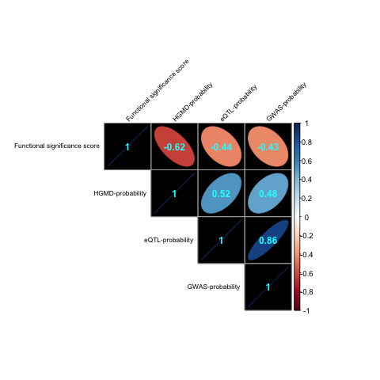

# DeepSEA Analyses

## Introduction  

<h4> 
Most GWAS hits fall within non-coding regions of the genome which makes functional interpretations of disease-associated variants challenging (relative to protein-coding regions). Kunkle et al. (2019) published the largest Alzheimer's Disease (AD) GWAS to date that identifed 24 AD-associated genetic loci. While we only have accesss to the summary statistics from that study, we do have access to ROSMAP, which is a large multi-omics dataset that includes whole-genome sequencing data for 405 Alzheimer's Disease patients.  
 
[DeepSEA](deepsea.princeton.edu) is a deep learning-based epigenomic mark prediction algorithm. Here, we apply this algorithm to the ROSMAP genomic data (subset according to the AD-associated loci identified by Kunkle et al (2019)) in order to elucideate the regulatory mechanisms, as well as relevant tissues and cell types, through which AD emerges.
</h4>

## Methods

See full code [here](./DeepSEA.R).  

### 1. Preprocess Raw Genotype Data

- First we extracted subsets of the ROSMAP genotype files (VCF) for each locus identified in the Kunkle et al. (2019) GWAS using Tabix. Only variants that were signficant GWAS hits (FDR <= 0.05) were extracted (except for *NYAP1*, which would have yielded no SNPs at this threshold). Limits of each locus were determined by the respective LD block coordinates provided in the publication (Supplementary Table 9.). Loci included:
	+ *ABCA7*  
	+ *BIN1*  
	+ *MS4A2* (Contains MS4A4A)
	+ *NYAP1* (Contains PILRB; No hits in Kunkle GWAS at FDR <= 0.05?) 
	+ *PTK2B*  
	+ *SPI1*  
	+ *TREM2*
- For each locus VCF file, we then used `bcftools` to:
	+ forced multi-allelic sites to be biallelic using `bcftools norm -m-`. 
	remove any variants that had allele sequence length (reference or alternative) > 100
	+ replaced aterisks (indicating deletions) with blanks, as required by DeepSEA.  

### 2. Run DeepSEA

- We submitted each locus VCF to the DeepSEA server via the web application (deepsea.princeton.edu), and downloaded the variant-level results as text files. Resulting metrics include:
	+ `eQTL-probability`: Probability that the position is an eQTL in the GRASP Database.   
	+ `GWAS-probability`: Probability that the position is a significant hit in the GWAS Catalogue. 
	+ `HGMD-probability`: Probability that the position is deleterious, according to the HGMD database
	+ `Functional significance score`: Aggregate probability that mutations at this position have a functional impact.
	+ `logFC`: log fold-change enrichment score (computed by comparing the differnces between the predicted effects of the ref vs. alt alleles) for each SNP for each epigenetic annotation.

### 3. Merge with GWAS Summary Statistics. 

- DeepSEA results were then merged with variant-level summary statistics from the Kunkle et al. (2019) GWAS in order to compare the DeepSEA predictions with the GWAS results.

### 4. Plot 

- **Figure 1.** :: *Cross-prediction Correlations*: To identify whether some DeepSEA predictions tended to covary, we calculated pair-wise Pearson's R correlations.
	+ *Results Summary*: `eQTL-probability` and `GWAS-probability` were highly correlated, which agrees with previous consistent observations that GWAS and eQTL overlapping sets of variants in part due to linkage disequilibrium (LD).  
	+ Download full-sized file [here](https://github.com/RajLabMSSM/DeepSEA/raw/master/ROSMAP/_plots/DeepSEA.corrplot.png).
	

- **Figure 2.** :: *GWAS + DeepSEA Track Plot*: A stacked track plot shows (top to bottom):
	+ `Kunkle (2019) GWAS`: -log10 of the nominal p-value from the Kunkle et al. (2019) GWAS
	+ `eQTL-probability`
	+ `GWAS-probability`
	+ `HGMD-probability`
	+ `Functional significance score`
	+ `Enrichment`: Bar plots of of the logFC for the top SNPs with the highest `Functional significance score` within that locus. RSIDs are shown above their respective annotations, which include information about the tissue/cell line from which they came. There are many more signficant enrichment results but we just focused on these three per locus since they were most likely to have a functional impact.
	+ Download full-sized file [here](https://github.com/RajLabMSSM/DeepSEA/raw/master/ROSMAP/_plots/DeepSEA.predict.enrich.png).
 

	 
## References  

- * Kunkle, Brian W., Benjamin Grenier-Boley, Rebecca Sims, Joshua C. Bis, Vincent Damotte, Adam C. Naj, Anne Boland, et al. “Genetic Meta-Analysis of Diagnosed Alzheimer’s Disease Identifies New Risk Loci and Implicates Aβ, Tau, Immunity and Lipid Processing.” Nature Genetics 51, no. 3 (2019): 414–30. https://doi.org/10.1038/s41588-019-0358-2.*  

- * Zhou, Jian, and Olga G. Troyanskaya. “Predicting Effects of Noncoding Variants with Deep Learning-Based Sequence Model.” Nature Methods 12, no. 10 (2015): 931–34. https://doi.org/10.1038/nmeth.3547. *

- [DeepSEA online server](deepsea.princeton.edu)  

- [Tensorflow implementation of DeepSEA](https://github.com/danvk/deepsea)  

- [Selene](https://selene.flatironinstitute.org)

## Author
### Brian M. Schilder
#### Raj Lab
#### Icahn School of Medicine at Mount Sinai
#### New York, NY

